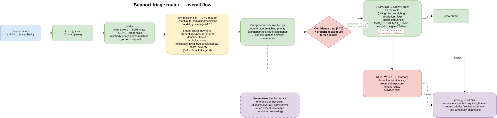

# support-triage-router

Support ticket triage: a plain-code router that makes one structured
decision call to Jev (via OpenRouter) per ticket, then — for tickets that
clear the confidence gate — dispatches to a CrewAI crew scoped to the
chosen route. The router itself is not an agent; it is deterministic
Python that composes typed Jev answers.

## Flow diagram



*Rendered from docs/flow.drawio — open it in draw.io to edit.*

```
tickets.jsonl
     │
     ▼
intake/state builder ── redaction of credential-looking tokens
     │  (features: fenced json/yaml blocks, stack traces,
     │   log lines, keywords, customer tier, urgency markers)
     ▼
Jev decision call — ONE request, questions answered in parallel
     ├─ noul   : is_churn_risk, is_payment_issue, is_credential_exposure,
     │           is_urgent_deadline, is_how_to_question
     ├─ choice : route ∈ {billing, technical_bug, escalation, faq}
     └─ score  : severity (0–1 normalized + legend → priority 1–4)
     │
     ▼
compose in code (weighted signals, named constants)
     │
     ├── confidence ≥ gate AND route resolvable
     │        └──► dispatch CrewAI crew for that route
     └── confidence < gate OR insufficient_info / credential exposure
              └──► review queue (requires_human, never guessed)
```

## Schema and dataset

- Ticket schema: [`schema/ticket.schema.json`](schema/ticket.schema.json)
- Synthetic dataset: 24 tickets (`TCK-0001`..`TCK-0024`) at
  `data/synthetic/support_tickets_synth_v1.jsonl`, each carrying an
  `expected.*` block used as ground truth for `triage eval` (stripped
  before routing).

## Setup

```
uv sync
```

Python 3.11 is pinned via `.python-version`; `uv.lock` is committed so
`uv sync --frozen` reproduces the exact environment used in CI.

## Usage

```
triage run --tickets data/synthetic/support_tickets_synth_v1.jsonl \
    --provider fake --out decisions.jsonl
triage eval --decisions decisions.jsonl \
    --tickets data/synthetic/support_tickets_synth_v1.jsonl
```

`--provider fake` is keyless and network-free (used by CI and local
dev). `--provider live` calls Jev over OpenRouter and requires
`OPENROUTER_API_KEY` in the environment; `--dispatch` additionally
invokes the CrewAI crews, which also need that key. Never hardcode the
key — source it from a secrets manager, e.g. with 1Password's CLI:

```
op run --env-file=.env.op -- triage run --tickets ... --provider live --dispatch
```

## Architecture notes

- **Router = plain code + Jev.** `router.py` is a deterministic
  composition step over one Jev decision response (weighted signals as
  named constants, a confidence gate) — it is not itself an agent.
- **Crews are lazy.** `dispatch.py` is the only module that imports
  `crewai`, and only inside functions, so importing it — and running
  the rest of the suite — never pulls `crewai` into `sys.modules`
  unless a crew is actually built.
- **Never-raises batch contract.** `dispatch()` and the `eval`/`run`
  CLI paths never let an exception escape per-ticket processing: an
  unknown/missing route is reported `skipped`, and a crew/kickoff
  failure is reported `error` with the exception message, so one bad
  ticket never aborts a batch.
- **Redaction first.** Only derived, redacted ticket state
  (`intake.build_state`) is ever handed to Jev or a crew — never the
  raw ticket body or embedded secrets.

## CI

`.github/workflows/ci.yml` runs on every PR and on push to `main`,
keyless (uses only the `fake` provider path in tests, no dispatch, no
`OPENROUTER_API_KEY`):

- **lint** — `uv sync --frozen` then `uv run ruff check src tests`
- **test** — `uv sync --frozen` then `uv run --frozen python -m unittest discover -v`

## Run manually

Commands actually executed against this checkout, with real output:

```
$ uv sync --frozen
Uninstalled 3 packages in 11ms
 - iniconfig==2.3.0
 - pluggy==1.6.0
 - pytest==9.1.1
```

```
$ uv run python -m unittest discover -v
...
----------------------------------------------------------------------
Ran 87 tests in 1.680s

OK
```

```
$ uv run ruff check src tests
All checks passed!
```

```
$ uv run triage run --tickets data/synthetic/support_tickets_synth_v1.jsonl \
    --provider fake --out /tmp/decisions.jsonl
processed 24 tickets
counts by route:
  billing: 5
  escalation: 3
  faq: 7
  technical_bug: 9
counts by disposition:
  dispatch: 12
  review: 12
dispatch: 12  review: 12
```

```
$ uv run triage eval --decisions /tmp/decisions.jsonl \
    --tickets data/synthetic/support_tickets_synth_v1.jsonl
eval report (24 tickets scored)
  route accuracy:    16/24 (66.7%)
  priority accuracy: 12/24 (50.0%)  [none-priority reviews: 0]
  review accuracy:   12/24 (50.0%) (vs expected.requires_human)
  unmatched decisions: 0
  ambiguity diagnostics (informational, not scoring target):
    clear: total=21 dispatch=10 review=11 review_correct=10 (47.6%)
    ambiguous: total=2 dispatch=2 review=0 review_correct=1 (50.0%)
    insufficient_info: total=1 dispatch=0 review=1 review_correct=1 (100.0%)
```

The `fake` provider is deterministic-but-synthetic (not calibrated to
maximize these scores); it exists to exercise the pipeline keylessly,
not to demonstrate live Jev decision quality.
